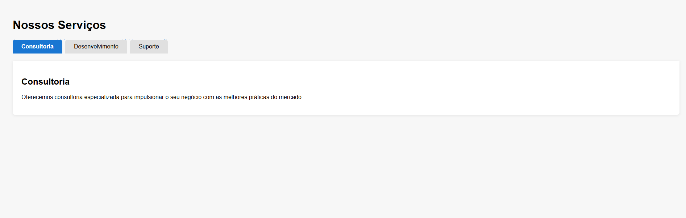

# Sistema de Abas de Conteúdo

Este projeto foi desenvolvido como parte de um desafio proposto pelo professor Luan. O objetivo é criar um sistema de abas simples e funcional para alternar o conteúdo de "Nossos Serviços" sem mudar de página.

## Funcionalidades
- Interface intuitiva para navegação entre abas
- Alternância de conteúdo usando classes CSS
- Destaque visual para a aba ativa
- Fácil de usar e personalizar
- Demonstração visual do funcionamento

## Como usar
1. Abra o arquivo `tabs.html` em seu navegador.
2. Clique nas abas para visualizar o conteúdo de cada serviço.

## Demonstração
Veja abaixo uma imagem de demonstração do projeto:

## Autor
Victor Nascimento

## Desafio proposto pelo Prof. Luan